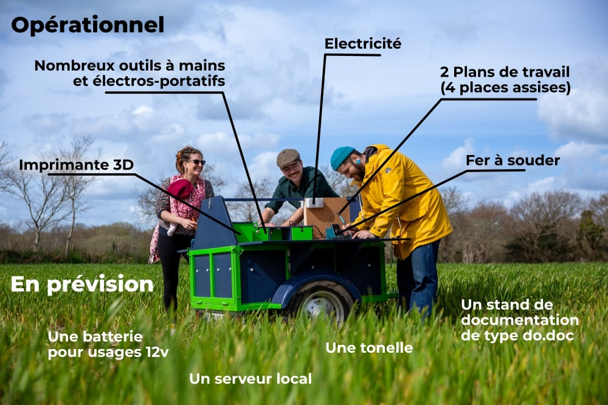

# Une Remorque atelier

### Un support à l'animation d'ateliers de coopérations

---




Faciliter des ateliers coopératifs en tous lieux, étendre les buts des Fab Lab et autres ateliers coopératifs, pouvoir se déployer hors les mures, pour toucher d'autres publics, animer des lieux de passages. Tel est l'objectif de cette petite remorque.

Ma conception est voulu comme open source, je documente mes travaux, mes idées, mes conceptions. Que vous souhaitiez reproduire cet outil à l'identique ou simplement vous en inspirer, vous trouverez ici je l'éspère un maximum d'informations pour vous lancer. 
 
En cas de besoin n'hésitez pas à me contacter. Vous trouverez mes coordonnées ici : https://www.guillaumeleguen.xyz/contact.html. 


## 1/ Toutes les clés pour se lancer

### 1.1 Télécharger l'archive

Avant toute chose, [télécharger l'archive du projet](https://github.com/gheleguen/remorque_atelier/archive/refs/heads/main.zip). C'est dans ce dossier que se trouve tous les fichiers de doicumantations mais aussi les fichiers de découpes ou les modèles d'impression 3D. 


**Ou passer par Git Hub**

Se rendre dans le [git hub](https://github.com/gheleguen/remorque_atelier) et télécharger l'archive complète du projet. 

**Ou en lignes de commandes**

 - Ouvrir un terminal linux,
 - Si ce n'est pas déjà fait installer ```git``` : <pre>sudo apt install git</pre>
 - Se placer dans le dossier de votre ordinateur où vous souhaitez installer enregistrer l'archive.
 - Cloner l'archive : <pre>git clone https://github.com/gheleguen/remorque_atelier</pre> 


### 1.2 L'arborescence de l'archive

 - **docs :** Est le dossier qui contient les documents et images qui constituent la documentation.  Ce sont des fichiers marckdown (.md) que l'on peut ouvrir avec un éditeur de texte.

 - **Hardware :** Le dossier qui contient les fichiers d'impressions 3D, de découpe laser...  


