# Aménagements intérieur

## 1/ Besoins et Solutions
### 1.1 Mes besoins
Afin de faciliter l'installation, j'ai fait le choix d'installer des rangements afin de garder à porté de mains des outils courants tel que un jeu de tournevis, de pinces, et quelques boites qui pourraient contenir de la visserie ou des pièces courantes. Tous ces rangements devront être bloqués pour ne pas s'ouvrir durant le voyage. A cela j'ai ajouté sur la partie qui sert de renfort à l'équerrage, 4 prises électrique 220V et un tableau en liège pour l'affichage. Une dernière contrainte se pose pour les rangements qui devront être le plus possible accessible du côté gauche comme du côté droit. 
On pourrait également prévoir :
 - Un Haut Parleur Bluetooth pour la musique
 - Un serveur locale
 - Un bloc pour ranger quelques livres.
 - Ruban LED ;  

### 1.2 Mes solutions
Je vais réaliser :
 - 3 tiroirs bloqués par des boutons de caravanes s'ouvrant dans les deux sens. Dans ces tiroirs pourront êtres rangés, tournevis, pinces et autre petit matériel de bricolage. 
 - Un bloc à portes pour des boites de visseries, et autres petites fournitures. 
 - Un panneau de liège ;
 - Deux trappes pour accéder à l'intérieur de la remorque ou créer un rangement pour les crayons, réglets et blocs notes. 

  
## 2/ Matériel et fournitures
### 2.1 Fournitures
|Dénomination|Visuel|Où se fournir ?|Qt|
|------|------|-----|--|
|Contreplaqué 10mm|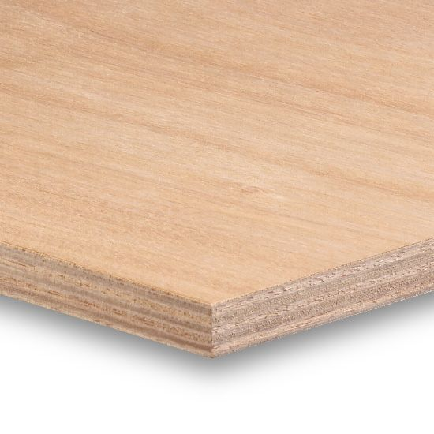|Magasin de bricolage|voir fichiers svg|
|Contreplaqué 5mm|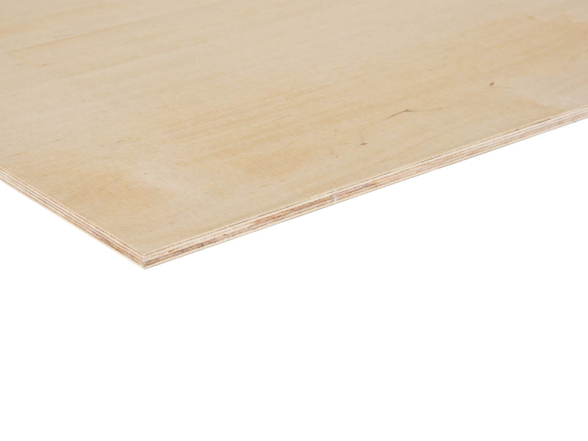|Magasin de bricolage|voir fichiers svg|
|Tasseau de 21*21mm|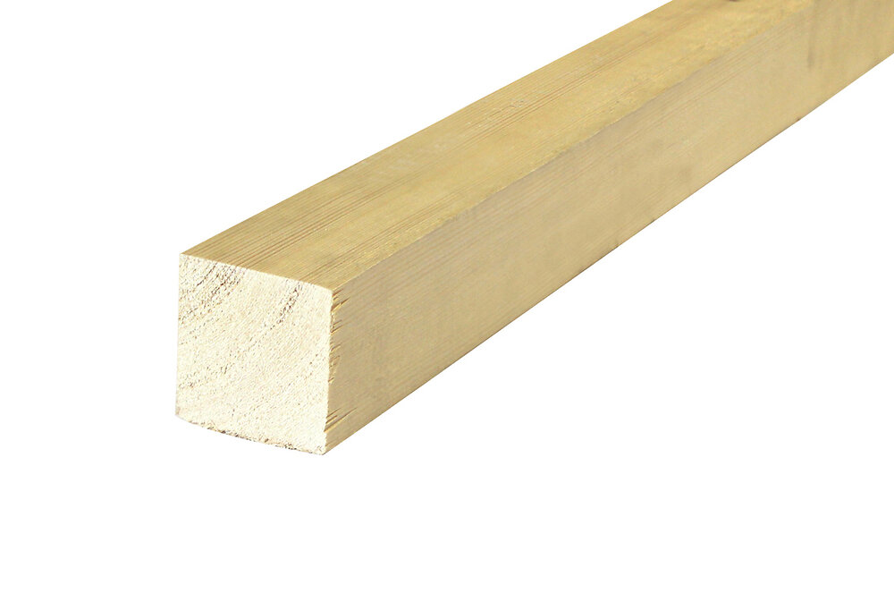|Magasin de bricolage|1|
|Tasseaux de 9*27mm|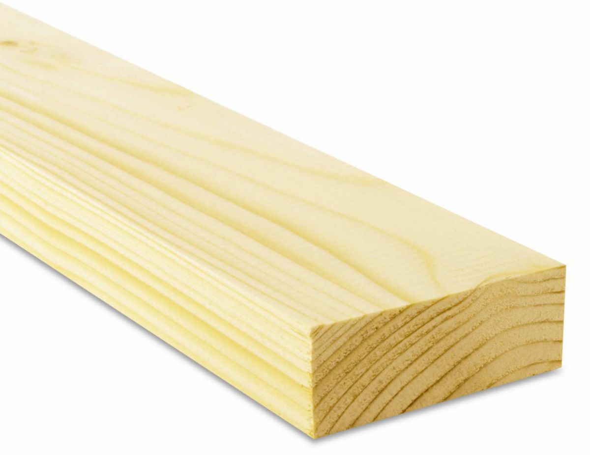|Magasin de bricolage|2|
|Tasseau de 13*13mm|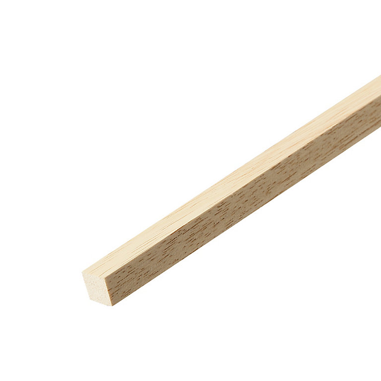|Magasin de bricolage|1|
|Loquet, boutons poussoirs de caravane|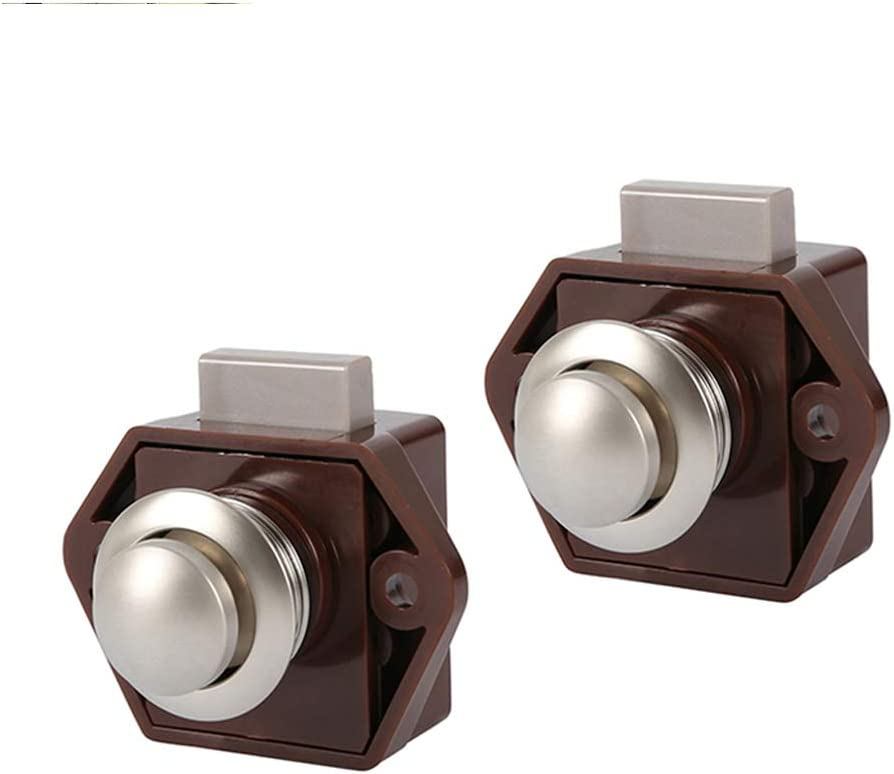|[Amazon](https://www.amazon.fr/Poussoir-Serrure-Fermoir-Caravane-d%C3%89paisseur/dp/B08P6ZFF7T?pd_rd_w=h537m&content-id=amzn1.sym.ef6c5961-4387-448e-95ad-7b3a0d0a846b&pf_rd_p=ef6c5961-4387-448e-95ad-7b3a0d0a846b&pf_rd_r=GV0A93SCEJN44CPXCQYB&pd_rd_wg=tJ169&pd_rd_r=9a0da424-d1f5-4f45-817a-fc3b650fc242&pd_rd_i=B08P6ZFF7T&psc=1&ref_=pd_bap_d_grid_rp_0_1_t) ou magasin de caravaning ou d'accastillage bateau|4|

### 2.2 Matériel utilisés
 - Colle à bois ;
 - Découpe Laser ou fraiseuse ou scie sauteuse, à chantourner;
 - Visserie ;
 - Équerre ;
 - Défonceuse ; 
 - Fraise cylinrique de 6mm ;
 - Imprimante 3D et filament adapté ;
 - Serre-joints ;
 - Tournevis court ;
 - Vis à bois et boulonneries ;
 

  
## 3/ Réalisation
### 3.1 Préparation des pièces
**3.1.1 Découpe Laser** 
A l'aide d'une machine à découpe laser, capable de découper du contreplaqué de 10mm, ou bien d'une fraiseuse à commande numérique, découper les pièces permettant de construire les meubles et les tiroirs. 
Les fichiers de découpes pour cette partie se trouvent dans dans le dossier "SVG_files" présent à la racine du dépôt.

|Nom du fichier|Visuel|Matériau|Qt|
|------|------|----|---|
|meubles_interieur_10mm.svg|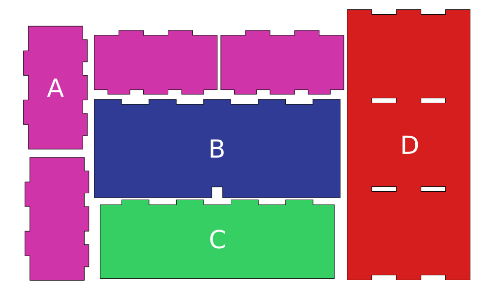|Contreplaqué 10mm, planche de min 600*1000mm|1|
|tiroir_10mm.svg|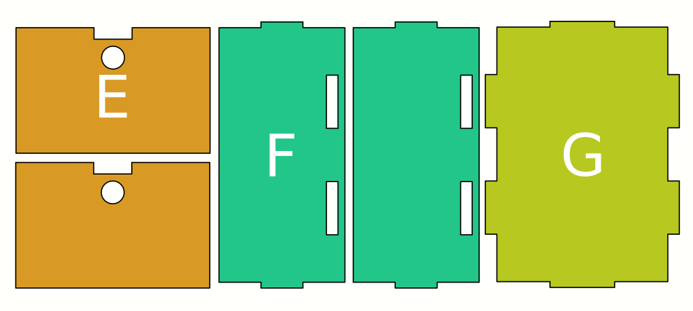|Contreplaqué 10mm, 3 planches de min 600*270mm |3|
|tiroir_5mm.svg|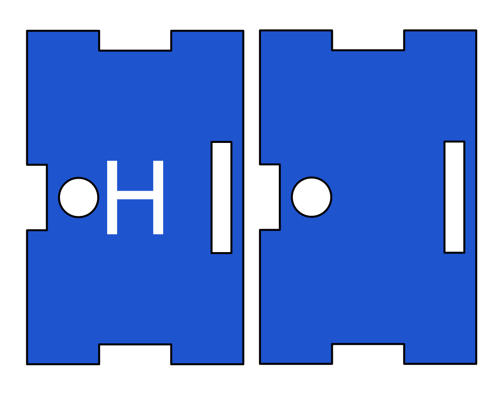|Contreplaqué 5mm, 3 planches de min 250*200mm|3|
|portes_meuble.svg|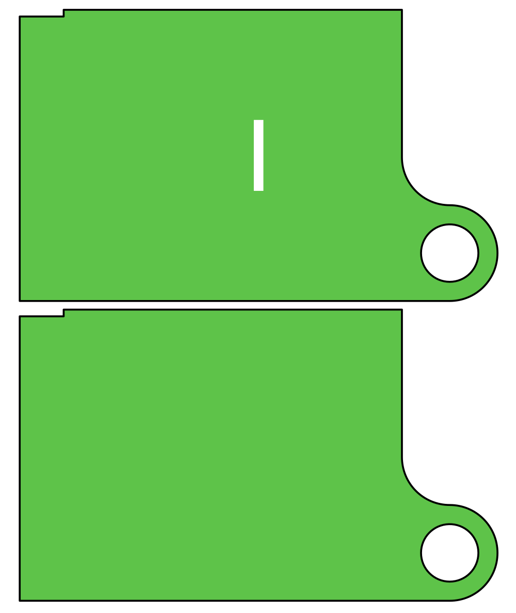|Contreplaqué 5mm, planche de min 270*320mm |1|

**3.1.2 Impression 3D** 
Imprimer en 3D de préférence en PETG ou en ABS pour une meilleure résistance 4 exemplaires du guide de porte coulissante (guide_porte.stl). Tous les modèles 3D se trouvent dans l'archive, dans le dossier "3D_models".

 
### 3.2 Assemblage des meubles
**3.2.1 Meuble à trois tiroirs**
 - Avec de la colle à bois, commencer à assembler le meuble à tiroirs. Encoller et placer les 4 cloisons "A" sur "D" aux emplacement définis. Attention à bien surveiller le bon équérrage des cloisons. On se servira d'équerres pour maintenir les pièces pendant le séchage. 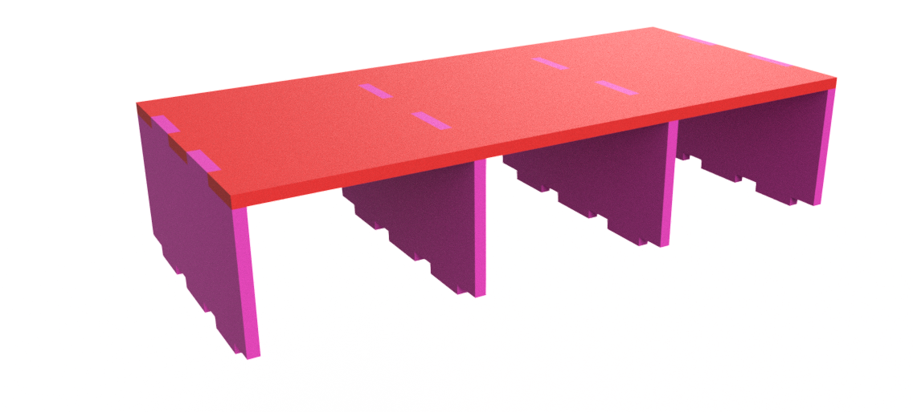
 - Le dessous du meuble, là où glisseront les tiroirs sera constitué de 4 tasseaux de bois de 27*9mm. Couper 4 longueur de tasseaux de 551mm chacun.   
 - Les visser sur les 4 "A" comme présenté ci dessous. Les visser permettra de les démonter pour pouvoir percer et loger la tête des vis qui permettront de fixer le meuble au plan de travail. 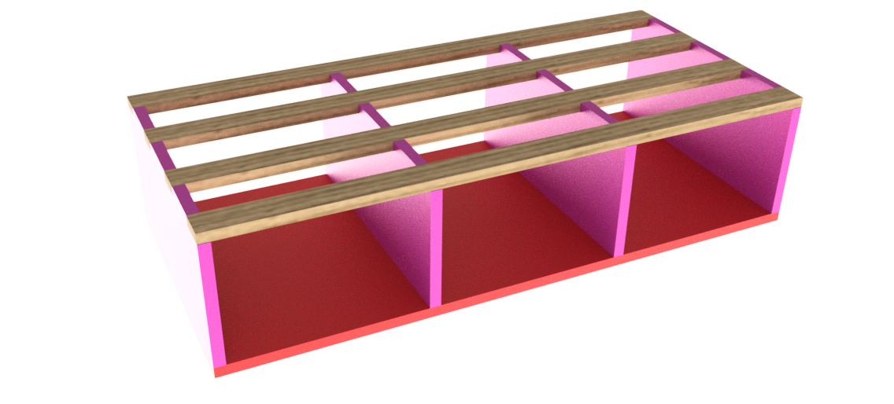

**3.2.2 Meuble à portes coulissantes**
 - Commencer par réaliser une nervure au moyen d'une défonceuse de 6mm de largeur à 5 ou 6mm du bord de chaque petit coté de la pièce "B" et de 5mm de profondeur. 
  - Assembler ce meuble en collant à 90° les deux parties "B" et "C" que l'on pourra équerrer au moyen d'une baguette de 13mm de coté. 
  - Visser au raz de la fente de coulissement 2 tasseaux de 21*21 d'une longueur permettant au meuble une fois en place d'être bien équerré au plateau de la remorque. 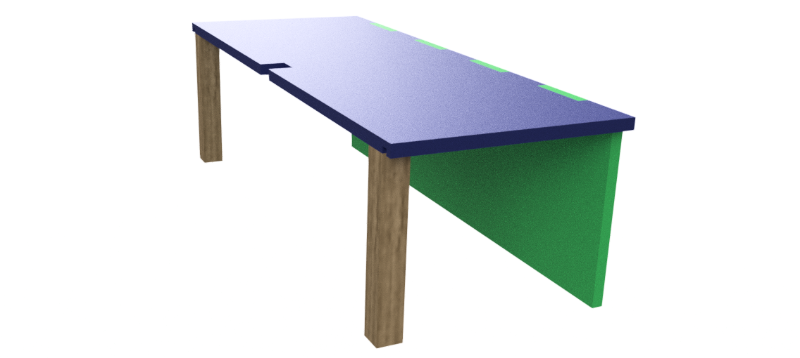

 
### 3.3 Assemblage des tiroirs
Les étapes suivantes sont à reproduire trois fois pour réaliser 3 tiroirs :
 - Coller le fond de tiroir "G" aux deux côté "F". 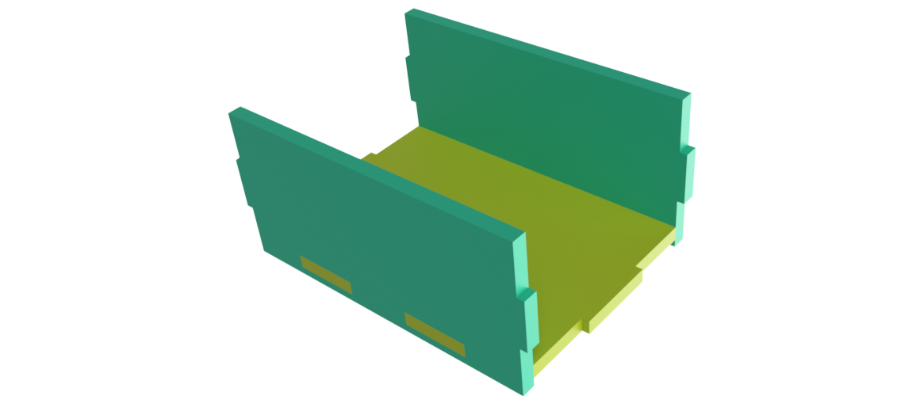
 - Coller les deux avant et arrières de tiroirs "H" aux plaques "G" et "F".
 - Maintenir le temps du séchage au moyen de serre-joints. 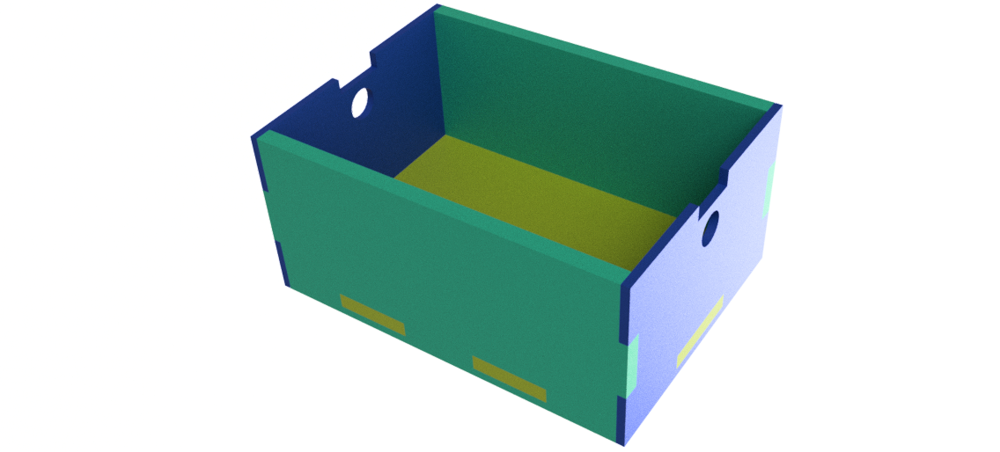
 - Coller les deux pièces "E" Par dessus les plaques "H" en veillant à les aligner rigoureusement. Serrer le temps de séchage. 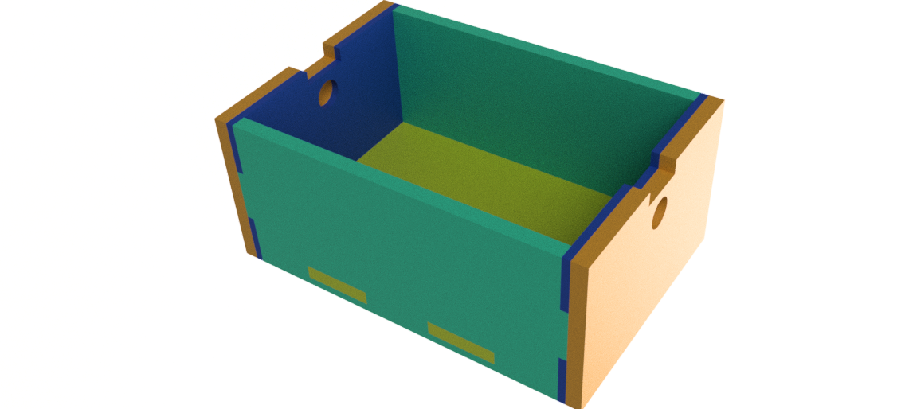
 - Au moyen d'un tournevis et de vis de 15mm maximum visser 2 loquets à poussoir sur chaque tiroir. Il est recommandé d'utiliser un tournevis court. Veiller à bien aligner les loquets pour que ces derniers puissent s'ouvrir et se fermer sans accrocs. 
 - Positionne rune première fois les tiroirs sur le meubles et positionner méticuleusement les butée en métals qui sont fournis avec. Cette étape est délicate, les tiroirs doivent pouvoir s'ouvrir et se fermer dans les deux sens. Pour y parvenir, la butée en métal doit pouvoir passer dans l'encoche au dessu du trou circulaire des pièces "E" et "H".

### 3.4 Installation sur la remorque
 - Installer le meuble à porte coulissante le long de la paroie et le meuble à tiroir entre ce dernier et la cloison d'équerrage. 
 - Dans mon cas j'ai vissé le meuble à porte coulissante à la parois au moyen de vis à bois et boulonné le meuble à tiroirs au plateau, en incrustant dans les tasseaux les têtes de vis (pour ne pas géner l'ouverture des tiroirs). 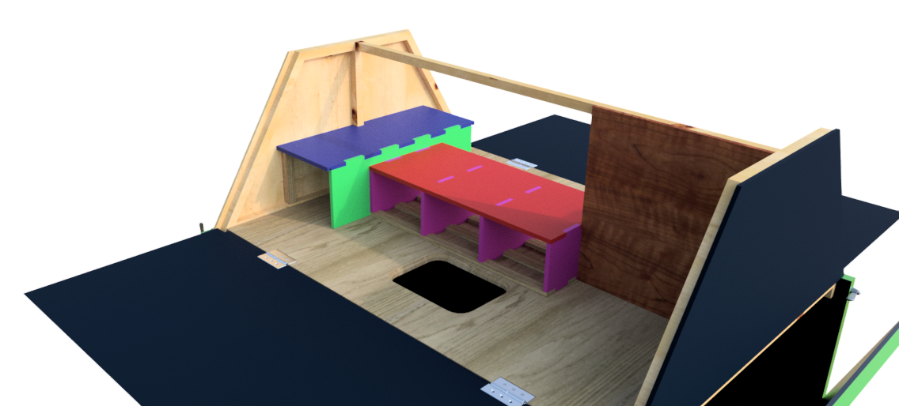
 - Insérer les tiroir et les portes coulissantes. Ces dernières nécessitent e visser les 4 guides imprimés en 3D sur le meuble à porte coulissantes. 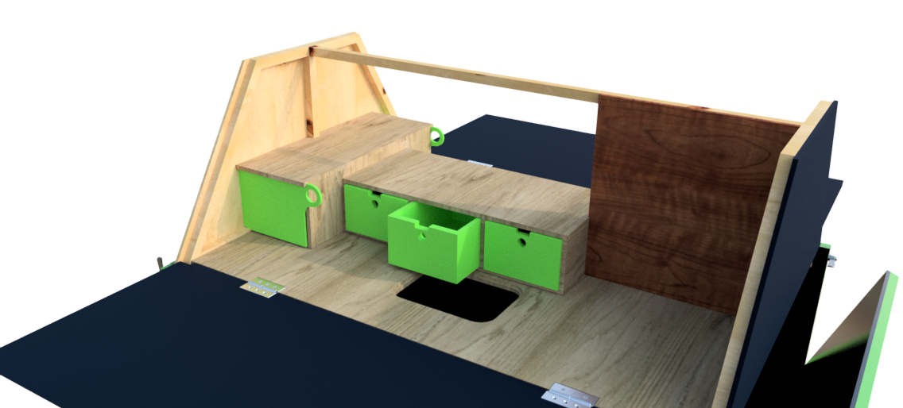

### 3.5 Cloison
Pour ce qui est de la cloison, j'ai doublé cette dernière au moyen de tasseaux de 21mm et de contreplaqué de 10mm. L'espace entre ces deux cloisons me permettent de passer des câbles et d'alimenter 2 prises 220V étanche. J'ai recouvert une face de liège épais pour l'affichage. 