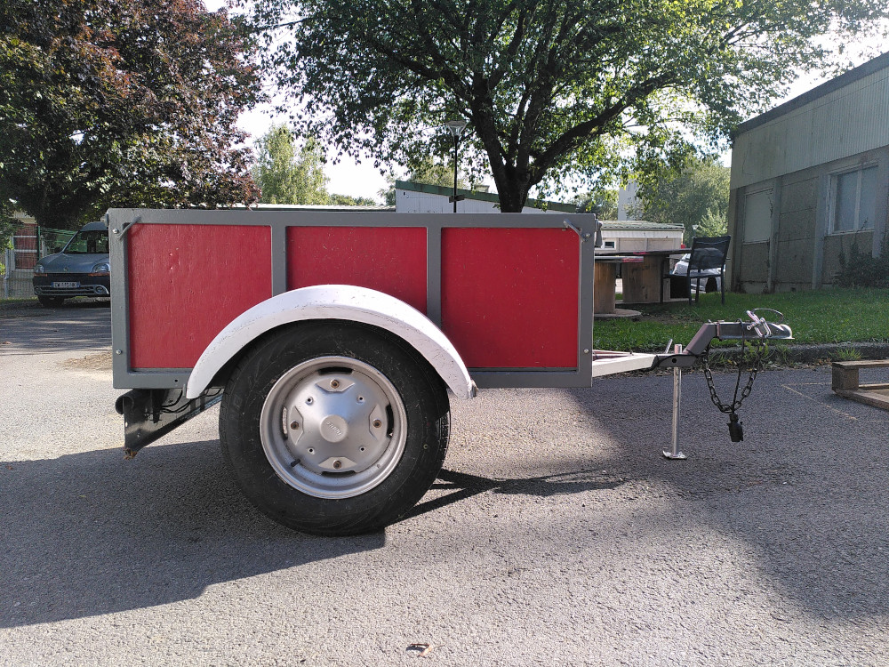

# Choix de la remorque

## 1/ Mon choix 
 
 - Petite remorque dont les dimensions sont de l'ordre du mètre ;
 - Parois en bois peint facilement démontable ;
 - Structure acier peint ;
 - Remorque artisanale restauré avec des roues de Fiat 500 ;
 - Deux portes ouvrantes ; 
 - Capacité de charge maximum (PTAC) 500kg pour 100kg à vide

## 2/ Recommandations à surveiller lors de l'achat

 - La charge maximale est à surveiller. Une première remorque visité n'avait pour PTAC que 300kg. Avec 75kg à vide, cette dernière ne pouvait être chargé que de 225kg au total. Ce qui est un peu juste pour un tel volume. 
 - Surveiller les amortisseurs ; 
 - Essayer d'ouvrir les portes ; 
 - Chercher les points de rouilles eventuels ;
 - Tester le mécanisme d'accrochage ; 
 - Tester les feux ; 