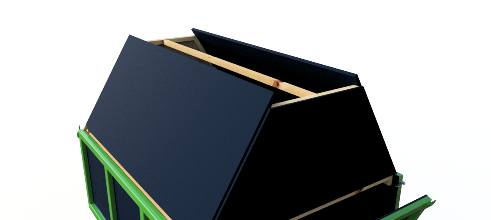
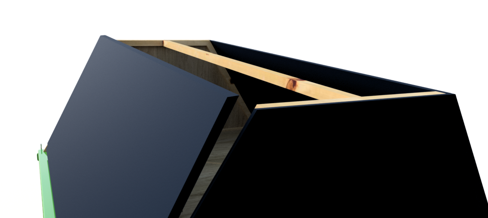
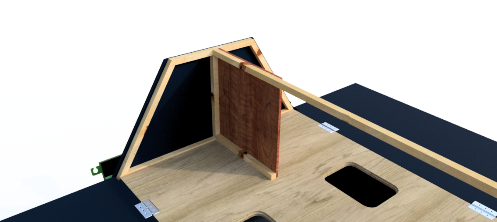
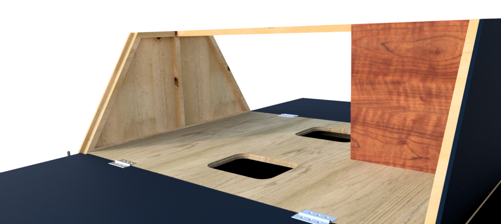

# Transformation

## 1/ Mes besoins

 Mon projet de remorque est destiné à servir de support pour animer des ateliers particulièrement pour de l'électronique, des ateliers de réparations, ou de menuiserie simple. J'ai donc besoin d'électricité à poste, avec potentiellement un mini serveur local pour partager des données. 
 
Mon souhait était également de combiner un espace qui se déploie en un geste tout en restant compacte pour la route. Mon cahier des charges était donc : 

 - Un plan de travail repliable et déployable en quelques gestes ; 
 - Pouvoir accueillir jusqu'à 4 places assises ; 
 - Un moyen de distribuer l'électricité dans la remorque et pouvoir se brancher facilement ;
 - Laisser un accés facile à quelques outils et ustensiles de bases ;
 - Intégrer une solution d'alimentation (câble et peut-être un jour une batterie.)
 - Ne pas dépasser le poids maximum (PTAC 500kg).

## 2/ Mes solutions
 - Une super-structure en bois placé sur le dessus de la remorque comportant 2 plateaux pouvants se déployer.
 - Ces plateaux reposent sur des supports rétractables. 
 - On peut entre les deux côtés de la remorque poser des cloisons avec des étagères, tirroirs, trappes. 
 - Un touret de câble sera placé dans la remorque pour pouvoir alimenter les besoins de la remorque via un branchement sur secteur (Ou prise caravane). 
 

Notes: L'aménagement intérieur sur ce visuel n'est pas tout à fait celui que j'ai réalisé (cf. Chapitre, Amménagement).

## 3/ Réalisation 

### 1.1. La structure en bois

 - Sur les bords internes de la remorque boulonner (de préférence avec la structure) deux tasseaux à fleur du haut de la remorque. 
 - Fixer deux traverses par assemblage mi bois.
 - Attention il est nécéssaire de réaliser cela en s'assurant qu'il est bien possible de fermer les portes de la remorque. 
 - Le fait de boulonner et non visser ce cadre va permettre de pouvoir par la suite désolidariser la super-structure de la remorque et permettre ainsi de pouvoir utiliser la remorque seule occasionellement. 
 - On peut ajouter deux traverses en bois, pour soutenir le futur plateau. 

 - Fabriquer en bois 2 trapèzes à l'aide de tasseaux (dans mon cas 21*21mm en pin).
 - Visser ces trapèzes perpendiculairement à la remorque, en solidarisant le bord long vers le bas. 

 - Mesurer la distance séparant les deux trapèzes au plus près du bord de la remorque. Si la remorque est bien parallèle la mesure prise au côté opposé devrai être rigoureusement la même. 
 - Réaliser une traverse qui sera placé au sommet de la superstructure,  elle permettra de maintenir les 2 trapèzes bien parallèle. 

 - Le long des trapèzes visser 2 tasseaux permettant de soutenir le plateau qui viendra se poser là. 

### 1.2 Découpe et poses des plateaux

 - Prendre scrupuleusement les mesures nécessaire du plateau. Largeur et longueur. Attention : Prendre une largeur à l'intersection du plateau et du trapèze. L'arrête du plateau ne devra pas dépasser des trapèzes. Cette vigilence est importante afin de s'assurer que les deux plateaux sur charnières puissent se fermer en s'appuyant sur les deux trapèzes.

 - Découper un plateau centrale en respectant scrupuleusement les côtes défini précédamment. 
 - Positionner ce plateau. S'assurer qu'il correspond au besoin.

 - On pourra si on le désire effectuer dans ce plateau des trous permettant de réaliser des rangements sous la plateau par exemple. Dans mon cas, j'ai réalisé cette perforation avec un gabarit, une défonceuse et une bague à copier. Enfin, j'ai réalisé un épaulement au moyen d'une fraise à copier. 

 - Découper dans du contreplaqué d'eppaisseur 10mm deux trapèzes dont la hauteur sera rigoureusement la même que ceux construit en tasseaux précademment. La largeur de ces trapèze devront être élargi de manière à dépasser de la structure en bois de chaque coté. Le dépassement sur les bords obliques devra être le même que celui de l'eppaisseur des deux plateaux mobiles. 

 - Découper les 2 plateaux mobiles dans du contre-plaqué de même éppaisseur que le plateau central. La longueur de ces plateaux doit permettre à ces derniers de s'appuyer sur les montants des trapèzes . Ces panneaux doivent pouvoir s'appuyer sur ces derniers. Une longueur à laquelle on retranchera une marge de l'ordre de 5 à 10mm afin de laisser un jour de par et d'autres des plateaux mobiles. Pour ce qui est de la largeurd des panneaux mobiles, s'assurer qu'ils dépassent de la structure afin de permettre plus tard une coupe oblique.

- Il est probable que l'angle des trapèzes en bois posent problème en position déplié. Pour laisser le plateau se déplier sans blocage. Il existe deux solutions. (1) Couper le morceau qui dépasse du plateau central ou (2) scier dans les plateaux mobiles une encoche, comme présenté ci-dessous. J'ai obté pour la première option. 

- Positionner ces plateaux le long du plateau central. Les plateaux mobiles affleurent-ils au plateau central ? Dans mon cas, le plateau central était 3 mm plus bas que les plateaux mobiles. Ceci est du au fait que les montants de ma remorque sont plus haut que la structure en bois que nous avons vissé à l'intérieur. Pour corriger cela, j'ai placé une baguette de bois de 3mm entre le plateau central et le bois sur lequel il repose. 
- Afin que les charnières ne dépassent pas, creuser au sciseau à bois des renfoncements de manière à ce que l'axe des charnières soit dans le prolongement de l'arrête haute du plateau central. 

- Une fois replié, le plateau doit se loger entre les deux trapèzes en contreplaqué et venir s'appuyer sur les montants en bois. 
- Visser les plateaux mobiles avec les charnières en prenant garde à laisser 1mm d'espace entre les deux plateaux en position déplié.
- A l'aide d'une scie circulaire scier les plateaux mobiles au bon angle afin que les bords de splateaux mobiles ne dépassent pas du trapèze en position replié. Attention il pourra être par la suite nécéssaire d'ajouter un joint adhésif. Auquel cas prévoir l'espace nécéssaire. 

### 1.3 Renforts

 - Afin d'équérrer la structure et d'éviter à cette dernière de plier lors du transport, j'ai ajouté un panneau en bois. Celui-ci a une longueur égale au tiers de l'espqce entre les deux trapèzes. J'ai pris une attention partivulière à obtenir une planche aux angles le plus droit possible. Un tasseau permettra de visser cette planche au plateau central. 

 - A l'opposé on peut ajouter un tasseau de bois en travers permettant de reprendre les efforts verticaux. Celui-ci sera vissé au trapèzes en contrplaqué au moyens de vis à bois. 

 - Afin de supporter les plateaux mobiles une fois dépliés, j'ai posé 4 equerres découpé dans une planche de contreplaqué de 15mm minimum. 
 - Ces equerres sont montés sur charnières de manière à pouvoir les (1) plier pour les transport. Dans cette position ces pièces de bois sont maintenu par des aimants puissants que j'ai incrusté dans le bois et collé à la colle PU. (2) Et déplier pour soutenir les deux plateaux mobiles en position déplier. 
 - Les charnières doivent être inscrustés dans le bois pour permettre une adhérence parfaite en position plié.
 - Les aquerres doivent être positionnés de manière à ce que les plateaux soit bien horizontaux une fois dépliés. 
 - Les charnières sont maintenues à la remorque par des vis que l'on peu visser dans les montants au moyen dans mon cas de trous taraudés, voir de rivets. 

### 1.4 Couvercle
**Détails à venir**

Le couvercle est réalisé en contreplaqué de 10mm. J'ai vissé des baguettes quarts de ronds sur les cotés pour bloquer l'ouverture des plans de travail. 

Deux fermetures à levier avec anneau à cadenas peuvent se placer sur les côtés afin de bloquer l'ouverture de la caisse
